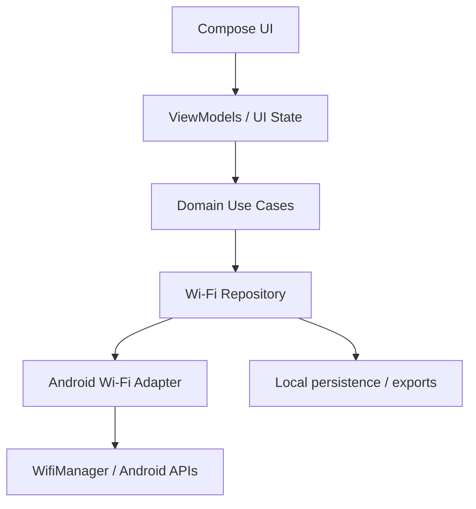

# Yeyecatl — Project Description and Objectives

> **Project type:** Android Wi-Fi field analyzer  
> **Family:** Tlalli / Ehécatl sibling project  
> **Primary platform:** Android  
> **Primary language:** Kotlin  
> **UI direction:** Jetpack Compose  
> **Development policy:** Makefile-first, test-first, privacy-aware

## 1. Project Description

**Yeyecatl** is a native Android application for observing, analyzing, recording, and comparing nearby Wi-Fi environments from a mobile device inspired in InSSIDer app/program.

It is the mobile sibling of **Ehécatl**. The two applications are independent implementations that share concepts and, eventually, interoperable observation/export contracts.

```text
Wi-Fi environment
      │
      ├── Ehécatl  ── Windows / PANGAEA observation
      │
      └── Yeyecatl ── Android / field observation
                         │
                         └── portable surveys, signal history,
                             channel analysis and export
```

Yeyecatl is an **observation and diagnostics tool**, not an offensive wireless-security suite. It must work within the Android security and permission model and must never attempt to bypass platform restrictions.

## 2. Product Objectives

### O1 — Reliable Wi-Fi discovery
Discover nearby access points exposed by Android and normalize scan data into a stable internal observation model.

Minimum fields when available:

- SSID
- BSSID
- RSSI / signal level
- center frequency
- channel number
- band (2.4 GHz, 5 GHz, 6 GHz)
- channel width
- security/capability information
- observation timestamp

### O2 — Useful channel analysis
Turn raw scans into information that helps a human understand the RF environment:

- channel occupancy
- overlapping networks
- relative signal strength
- repeated BSSIDs / multi-AP deployments
- band distribution
- signal changes over time

### O3 — Field mobility
Make the phone useful as a portable observer while moving through a home, office, lab, or other permitted environment.

The application should make it easy to:

- refresh observations
- freeze a scan snapshot
- compare snapshots
- annotate a capture
- inspect one network or BSSID
- review signal history

### O4 — 2.4 / 5 / 6 GHz first-class support
Treat 2.4 GHz, 5 GHz, and 6 GHz as explicit domains in the data model and UI. Never assume the handset supports every band; capability and observed data drive the UI.

### O5 — Privacy-first collection
Collect only what is necessary for wireless analysis.

Default principles:

- no cloud upload required
- no physical-location collection unless a later feature explicitly requires it
- no hidden background tracking
- no logging of BSSID/SSID/location-like identifiers in production logs unless explicitly needed and documented
- exports are user-initiated

### O6 — Reproducible engineering
All common development actions must be available through the repository `Makefile`.

Examples:

```text
make setup
make build
make test
make lint
make format
make check
make install-debug
make agents-check
```

The Makefile is the human-facing entry point; Gradle remains the Android build engine underneath.

### O7 — Testability and correctness
Keep Android framework calls behind adapters so domain logic can be tested without a device.

Critical calculations must have unit tests, especially:

- frequency → band classification
- frequency → channel conversion/fallback
- channel overlap logic
- observation normalization
- sorting/filtering
- permission/state decisions

### O8 — Ehécatl interoperability
Design the observation model so that Yeyecatl and Ehécatl can eventually export compatible data without forcing the two codebases to share implementation details.

## 3. Non-Goals

The initial project does **not** aim to provide:

- deauthentication or disassociation attacks
- password cracking
- credential capture
- packet injection
- Android permission bypasses
- stealth/background surveillance
- root-only monitor-mode functionality as a core requirement
- automatic geolocation of observed Wi-Fi networks
- replacing professional calibrated RF survey equipment

## 4. Initial Technical Direction



Architecture goals:

- Android APIs do not leak directly into domain models.
- UI observes immutable state.
- scan lifecycle and permissions are explicit states, not hidden side effects.
- RF calculations are pure functions where possible.
- storage/export formats are versioned.

Phase 0 platform and architecture decisions are recorded in:

- `docs/research/android-wifi-platform-contract.md`
- `docs/research/android-wifi-permissions-matrix.md`
- `docs/architecture/wifi-observation-model.md`
- `docs/architecture/scan-state-model.md`
- `docs/adr/ADR-001-android-sdk-baseline.md`
- `docs/adr/ADR-002-wifi-scan-permission-contract.md`
- `docs/adr/ADR-003-platform-neutral-observation-schema.md`
- `docs/adr/ADR-004-scan-freshness-and-state-semantics.md`
- `docs/adr/ADR-005-ssid-bssid-mlo-privacy.md`
- `docs/adr/ADR-006-android-application-identity.md`
- `docs/architecture/android-wifi-platform-readiness.md`
- `docs/adr/ADR-007-android-wifi-platform-readiness-boundary.md`
- `docs/architecture/android-wifi-scan-acquisition.md`
- `docs/adr/ADR-008-android-wifi-scan-acquisition-lifecycle.md`
- `docs/architecture/wifi-rf-interpretation.md`
- `docs/adr/ADR-009-pure-rf-interpretation-layer.md`
- `docs/architecture/wifi-spectrum-geometry.md`
- `docs/adr/ADR-010-nominal-spectrum-geometry.md`
- `docs/architecture/wifi-spectrum-visualization.md`
- `docs/adr/ADR-011-spectrum-visualization-boundary.md`
- `docs/testing/android-device-validation.md`
- `docs/testing/continuous-integration.md`
- `docs/architecture/app-shell.md`
- `docs/validation/phase-2zero/README.md`\n- `docs/architecture/wifi-temporal-observation.md`

## 5. Suggested Modules / Packages

This is a direction, not a mandatory multi-module split on day one.

```text
app/
  ui/
  navigation/
  platform/

domain/
  model/
  usecase/
  rf/

data/
  wifi/
  persistence/
  export/
```

Start simple. Split into Gradle modules only when build time, ownership, or dependency boundaries justify it.

## 6. Core Product Views

1. **Nearby Networks** — sortable list of current observations.
2. **Channel Graph** — overlapping channel/signal visualization per band.
3. **Network Detail** — SSID/BSSID, capabilities, frequency, width and history.
4. **Signal History** — time series for selected observations.
5. **Survey / Snapshot** — named captures and comparisons.
6. **Device / Capability** — what the Android device and current OS expose.

## 7. Milestone Direction

| Phase | Goal | Exit criterion |
|---|---|---|
| 0 | Platform research | permissions, scan restrictions and device capability model documented in research, architecture and ADR files |
| 1A | Android foundation | single-module Android app builds, tests and lints through Makefile targets |
| 1B | Platform readiness | Wi-Fi hardware, state and permission readiness exposed without scanning |
| 1C | Scan acquisition | user-triggered Android Wi-Fi scans acquired and displayed without RF/channel analysis |
| 1D | RF interpretation | raw observations interpreted into band, channel, width and Wi-Fi standard |
| 1E | Spectrum geometry | nominal occupied spans and geometric overlap calculated without interference scoring |
| 1F | Spectrum visualization | 2.4/5/6 GHz channel graph rendered from domain geometry without scoring |
| 1H | Launcher visual identity | production adaptive launcher icon with Yeyecatl foreground, background and themed monochrome layers implemented |
| 1I | Splash + app shell | branded splash, light/dark Compose theme and stable scanner shell implemented without changing RF behavior |
| 1 | Minimal scanner | nearby scans normalized and displayed reliably |
| 2-zero | Static signal ranking | latest snapshot exposes strongest/weakest rankings and lets the spectrum plot switch between All, Strongest 5 and Weakest 5 for the selected band, without temporal behavior |
| 2 | Analyzer | band/channel views and filtering implemented |
| 3 | History | observation persistence and signal history available |
| 4 | Field survey | snapshots, annotations and comparisons available |
| 5 | Interop | versioned export compatible with Ehécatl concepts |

**Phase 1H status:** complete. The production launcher identity uses mask-safe adaptive icon layers and supports Android 13 themed icons.

**Phase 1I status:** implementation complete on the feature branch; final acceptance requires GitHub CI and Galaxy J8 validation.

**Phase 2-zero status:** complete and physically validated on the Samsung Galaxy J8. The latest scan snapshot is ranked by RSSI and the spectrum can switch between `All / Strongest 5 / Weakest 5` within the selected band. The complete scan snapshot and diagnostic list remain unchanged; no temporal observation semantics were introduced.\n\n**Phase 2A.1 status:** temporal domain baseline introduced. Fresh scan snapshots accumulate RSSI samples by BSSID using snapshot receipt time; cached/unknown snapshots do not create history points.\n\n**Phase 2A.2 status:** foreground dynamic scan cadence introduced. Dynamic mode is explicit, pauses outside the Activity foreground, requests scans every 30 seconds, exposes temporal sample counters, and bounds each BSSID history to the most recent 120 samples. Android scan rejection remains a normal platform outcome; background scanning, smoothing, persistence and time-series plotting remain out of scope.

## 8. Definition of Done

A feature is done only when:

- acceptance criteria are satisfied
- unit/integration tests are green
- Android permission/state behavior is covered
- no sensitive wireless identifiers are unnecessarily logged
- lint/static analysis is clean
- build works through Makefile targets
- affected documentation is updated
- the Reviewer finds no blocking issue

## 9. Guiding Principle

> **Observe accurately, explain clearly, collect minimally.**

Yeyecatl should help the user understand the radio environment without pretending Android exposes more RF information than it actually does.
