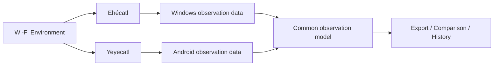
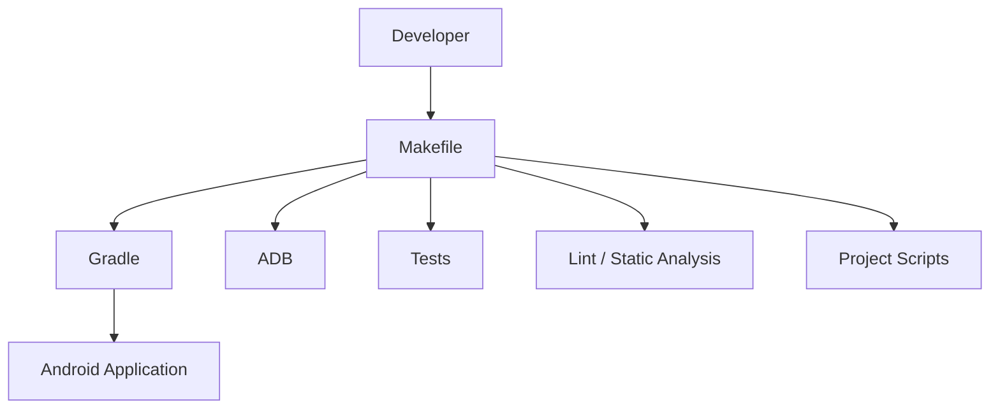
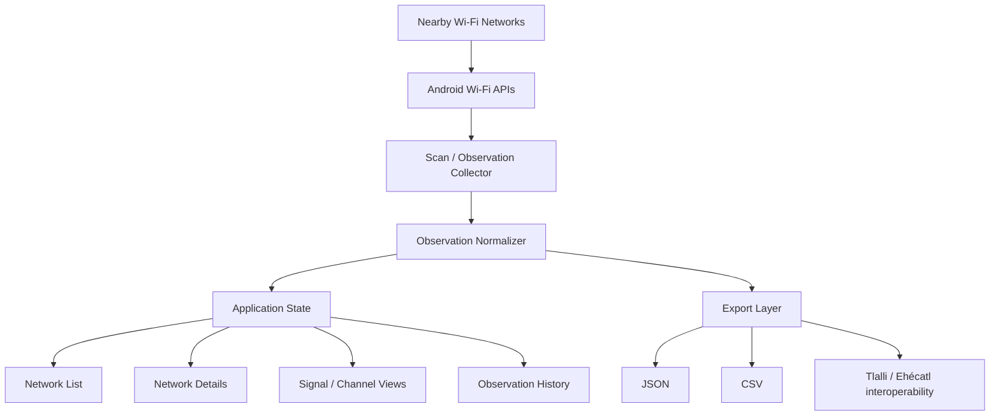

<p align="center">
  
</p>

<h1 align="center">Yeyecatl</h1>

<p align="center">
  <strong>Android Wi-Fi cartography and wireless observation for Tlalli.</strong>
</p>

<p align="center">
  A mobile sibling of <strong>Ehécatl</strong>, designed to observe, map, inspect and understand the Wi-Fi environment directly from Android devices.
</p>

---

## Project Description

**Yeyecatl** is an Android-focused Wi-Fi analysis project built as a separate companion to **Ehécatl**, the Windows/PANGAEA analyzer.

Both projects belong to the same conceptual family, but they are intentionally independent applications:

```text
Tlalli
│
├── Ehécatl
│   └── Windows / PANGAEA Wi-Fi analyzer
│
└── Yeyecatl
    └── Android mobile Wi-Fi analyzer
```

The purpose of Yeyecatl is to transform an Android phone into a portable Wi-Fi observation instrument: useful while walking through a house, lab, office or neighborhood and seeing how the wireless environment changes from place to place.

The project is not intended to be a simple "show nearby SSIDs" application. Its long-term goal is to build a structured, reproducible and exportable view of wireless observations that can later be compared with data captured by Ehécatl and other parts of the Tlalli network lab.

---

## Why the name Yeyecatl?

**Yeyecatl** continues the naming lineage started with **Ehécatl** and the broader Tlalli environment.

The name is associated with the idea of **wind / moving air**, which fits the project well: radio signals are invisible, dynamic and constantly changing around the observer.

For this repository and application, the canonical spelling is:

```text
Yeyecatl
```

Suggested repository name:

```text
yeyecatl
```

---

## Relationship with Ehécatl

Yeyecatl should not be treated as an Android build of the same desktop codebase.

The two applications have different operating-system APIs, permissions, hardware visibility and user-interaction models.

They should instead share **concepts and data contracts**.



### Ehécatl

- Desktop-oriented.
- Runs primarily on **PANGAEA / Windows**.
- Can evolve toward Windows WLAN APIs and lower-level native collectors.
- Better suited for stationary observation, longer sessions and richer desktop visualization.

### Yeyecatl

- Mobile-oriented.
- Runs on **Android**.
- Uses Android's Wi-Fi APIs and the capabilities exposed by the device.
- Better suited for walking surveys, room-by-room inspection and portable measurements.

---

## Initial Goals

Yeyecatl should eventually be able to:

- discover nearby Wi-Fi networks;
- display SSID and BSSID information exposed by Android;
- measure received signal strength;
- identify channel and frequency;
- classify networks by Wi-Fi band;
- observe security capabilities reported by the device;
- track observations over time;
- compare repeated scans;
- filter and sort discovered networks;
- visualize signal changes;
- export observations in machine-readable formats;
- share a compatible observation model with Ehécatl;
- support later site-survey and heatmap experiments.

---

## Wi-Fi Bands

The project is intended to understand all modern Wi-Fi bands that Android hardware and the operating system make available to the application.

| Band | Typical Wi-Fi usage | Yeyecatl target |
|---|---|---|
| **2.4 GHz** | Long range, crowded spectrum, legacy and IoT devices | Yes |
| **5 GHz** | Higher throughput, many modern WLAN deployments | Yes |
| **6 GHz** | Wi-Fi 6E / Wi-Fi 7 capable environments | Yes |

Actual visibility depends on the Android device, chipset, Android version, regional regulatory configuration and the APIs exposed by the operating system.

Yeyecatl therefore records **what the device can actually observe**, rather than assuming every Android phone has identical radio capabilities.

---

## Proposed Android Stack

The preferred application direction is:

| Layer | Technology |
|---|---|
| Language | **Kotlin** |
| UI | **Jetpack Compose** |
| Wi-Fi integration | Android Wi-Fi APIs / `WifiManager` |
| Local persistence | Room / SQLite, when persistence is introduced |
| Structured data | Kotlin serialization or equivalent structured models |
| Build | Gradle underneath the Android project |
| Project entry points | **Makefile** |

Phase 1 SDK baseline decisions are documented in `docs/adr/ADR-001-android-sdk-baseline.md`: `minSdk = 29`, `targetSdk = 36`, and `compileSdk = 36`. These are Phase 1 decisions, not immutable project requirements.

Android identity is documented in `docs/adr/ADR-006-android-application-identity.md`: `namespace = "io.github.dante_souza.yeyecatl"` and `applicationId = "io.github.dante_souza.yeyecatl"`.

The Makefile remains the human-facing execution layer for the repository.

Developers should not need to remember long Gradle, ADB or helper-script commands for routine project operations.

Common workflow:

```text
make help
make setup
make build
make test
make unit-test
make android-test
make lint
make check
make install-debug
make adb-devices
make clean
```

Gradle and ADB remain available underneath these targets, but routine local development should start with `make`.

---

## Makefile-First Principle

As with the wider project family, **all normal development entry points should be exposed through `make`**.



Gradle, ADB and supporting scripts still exist, but the Makefile acts as the stable orchestration interface.

This keeps the project reproducible and consistent with the rest of the Tlalli tooling.

---

## Observation Model

A central design goal is to separate the **radio observation** from the platform that collected it.

A future observation may contain fields such as:

```text
Observation
├── timestamp
├── device
├── platform
├── ssid
├── bssid
├── frequency_mhz
├── channel
├── band
├── rssi_dbm
├── security
├── capabilities
└── optional location / survey metadata
```

The exact schema will evolve as we inspect what Android exposes reliably across versions and devices.

The Phase 0 observation and scan-state contracts are documented in:

- `docs/architecture/wifi-observation-model.md`
- `docs/architecture/scan-state-model.md`

The Phase 1B/1C Android implementation boundaries are documented in:

- `docs/architecture/android-wifi-platform-readiness.md`
- `docs/architecture/android-wifi-scan-acquisition.md`
- `docs/architecture/wifi-rf-interpretation.md`
- `docs/architecture/wifi-spectrum-geometry.md`

This shared model will make it possible to compare Yeyecatl observations with Ehécatl captures later without forcing both applications to share implementation code.

---

## Conceptual Architecture



The application should remain modular enough that Android-specific collection code does not become mixed with presentation, persistence or export logic.

---

## Possible Application Views

Initial research and prototypes may eventually lead to views such as:

- nearby network list;
- signal-strength view;
- channel occupancy view;
- band filter: 2.4 / 5 / 6 GHz;
- network details;
- BSSID / AP view;
- scan history;
- signal-over-time graph;
- comparison between scans;
- survey mode;
- export screen.

Later phases may experiment with spatial visualization and heatmaps when location sampling is meaningful and explicitly enabled.

---

## Privacy and Permissions

Android places deliberate restrictions around Wi-Fi scanning and nearby-device information.

Yeyecatl should treat permissions as part of the architecture rather than as an afterthought.

Design principles:

- request only permissions required for a feature;
- explain why each permission is needed;
- keep normal analysis local whenever possible;
- do not require cloud services merely to inspect local Wi-Fi observations;
- make export an explicit user action;
- avoid collecting unrelated device information.

---

## What Yeyecatl Is Not

Yeyecatl is a **Wi-Fi network analyzer**, not a software-defined radio or laboratory RF spectrum analyzer.

The distinction matters:

```text
Wi-Fi analyzer
    sees information exposed by the Wi-Fi chipset / operating system

RF spectrum analyzer
    measures raw radio-frequency energy across a spectrum
```

An Android phone can provide valuable Wi-Fi telemetry, but it does not automatically provide raw access to everything happening in the RF spectrum.

The project will document these boundaries rather than pretending the phone can measure data its hardware or Android does not expose.

---

## Project Principles

1. **Observe before optimizing.**
   Capture the environment before drawing conclusions about it.

2. **Keep raw observations.**
   Derived visualizations should not replace the underlying measurements.

3. **Separate collection from presentation.**
   Android-specific APIs should remain isolated from the UI and analysis layers.

4. **Prefer reproducible workflows.**
   Routine actions belong behind Makefile targets.

5. **Document platform limitations.**
   Android version and hardware differences are part of the dataset.

6. **Maintain interoperability with Ehécatl.**
   Share concepts and observation formats, not unnecessary implementation coupling.

7. **Treat 6 GHz as a first-class band.**
   Modern Wi-Fi analysis should not stop at 2.4 and 5 GHz.

---

## Initial Roadmap

### Phase 0 — Research

- inspect Android Wi-Fi APIs;
- document permission requirements by Android version;
- inspect available scan-result fields;
- determine how 2.4, 5 and 6 GHz observations are reported;
- define the first observation schema.

Phase 0 outputs are recorded in `docs/research/`, `docs/architecture/`, and `docs/adr/`.

### Phase 1A — Android Foundation

- create the single-module Android project;
- configure Kotlin, Jetpack Compose and Material 3;
- add placeholder Yeyecatl UI only;
- configure JVM unit tests and Android instrumentation test infrastructure;
- expose build, test, lint, install and adb entry points through Makefile.

### Phase 1B — Android Wi-Fi Platform Readiness

- declare only the Wi-Fi and location permissions/features needed for platform readiness and future foreground discovery;
- expose Wi-Fi hardware, Wi-Fi state, Location Services and scan-permission readiness;
- request scan permission only after explicit user action;
- keep Android Wi-Fi and permission APIs under `platform/wifi`;
- keep Wi-Fi scanning intentionally unimplemented.

### Phase 1C — Wi-Fi Scan Acquisition

- request a foreground Wi-Fi scan only after explicit user action;
- receive Android scan-result availability broadcasts through a dynamic receiver;
- map raw Android scan results into Android-independent observations;
- preserve cached/previous observations when Android rejects a request or reports stale results;
- keep RF/channel analysis, persistence and export intentionally unimplemented.

### Phase 1D — RF Domain Interpretation

- preserve raw scan observations separately from derived RF data;
- interpret observed frequencies into 2.4 GHz, 5 GHz, 6 GHz, 60 GHz or unknown bands;
- interpret primary channel, channel width, center frequencies and Wi-Fi standard where available;
- keep overlap, interference, recommendations, persistence and export intentionally unimplemented.

### Phase 1E — Spectrum Geometry and Channel Overlap

- calculate nominal occupied frequency spans from interpreted RF data;
- preserve 80+80 MHz as two independent segments with an unoccupied gap;
- calculate geometric overlap bandwidth using MHz intervals;
- keep interference analysis, scoring, recommendations and graphical channel views intentionally unimplemented.

### Phase 1 — Minimal Scanner

- create Android project;
- implement permission handling;
- collect nearby network observations;
- show basic network list;
- classify band and channel;
- expose development commands through Makefile.

### Phase 2 — Analyzer

- filtering and sorting;
- network detail screen;
- channel visualization;
- signal visualization;
- repeated scanning;
- structured export.

### Phase 3 — History

- local persistence;
- scan sessions;
- signal-over-time history;
- comparison between sessions.

### Phase 4 — Mobile Survey

- walking survey mode;
- optional spatial metadata;
- repeated measurements by location;
- experimental heatmaps.

### Phase 5 — Tlalli Integration

- common observation format with Ehécatl;
- import/export compatibility;
- desktop/mobile comparison workflows;
- optional integration with broader Tlalli monitoring tools.

---


## Agent-Assisted Development

Yeyecatl includes a repository-native agent system inspired by the **Cerberus** project pattern:

```text
AGENTS.md
├── repository-wide engineering policy
│
.github/agents/
├── product-owner
├── architect
├── wifi-domain
├── developer + task-worker
├── qa-engineer
└── reviewer + specialized reviewers
│
.github/skills/
├── android-platform
├── wifi-scanning
├── rf-analysis
├── compose-ui
├── architecture
├── test-strategy
├── security-privacy
├── quality-gates
├── logging
├── makefile-workflow
└── release
```

The agents do not replace project rules: `PROJECT.md` defines the product and objectives, `AGENTS.md` defines repository-wide operating rules, and skills provide focused technical policy that agents load according to the task.

Useful inspection commands:

```bash
make agents-list
make skills-list
make agents-check
```

---

## Repository Direction

A likely future repository organization is:

```text
yeyecatl/
├── README.md
├── Makefile
├── docs/
│   └── assets/
│       └── yeyecatl-logo.png
├── app/
├── scripts/
├── research/
└── samples/
```

This is only the architectural direction. The application scaffolding should be created deliberately after the Android API research phase rather than generated blindly at project start.

---

## Status

**Project status:** initial definition / research phase.

Current artifacts:

- project name selected: **Yeyecatl**;
- project identity defined;
- initial logo created;
- initial README created;
- Phase 0 Android Wi-Fi platform contract documented;
- Phase 0 observation model, scan-state model and ADRs accepted;
- Phase 1A Android project foundation created;
- Phase 1B Android Wi-Fi platform readiness created;
- Phase 1C foreground Wi-Fi scan acquisition created.
- Phase 1D pure RF interpretation created.
- Phase 1E nominal spectrum geometry created.

That separation is intentional: first define what the instrument should observe, then choose the exact implementation around the capabilities Android actually exposes.

---

## Project Family

```text
Tlalli
│
├── Yaxche
│   └── network backbone / routing
│
├── Ehécatl
│   └── Windows Wi-Fi observation
│
└── Yeyecatl
    └── Android Wi-Fi observation
```

**Ehécatl observes the air from PANGAEA.**

**Yeyecatl carries the observation into the field.**
