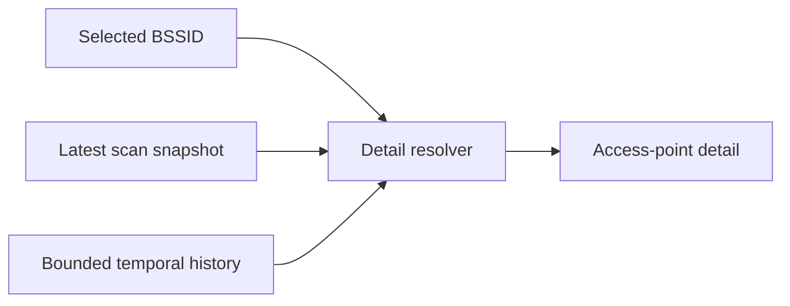

# Wi-Fi Access Point Selection and Detail Model

## Status

**Phase:** 2C.1  
**Scope:** BSSID selection plus current access-point detail model  
**Selection identity:** exact BSSID  
**Persistence:** none  
**Recommendation/scoring:** none

## Purpose

Phase 2C.1 establishes a stable selection boundary between the current nearby-network list and access-point detail presentation.

The user can select one currently observed BSSID from the nearby-network list. Yeyecatl resolves that selection against the latest scan snapshot and combines the current observation with already-retained Phase 2A signal history.

This phase does not introduce a new scanner, persistence store, vendor database, inference engine, or recommendation model.

## Selection contract

Selection is represented by:

```text
WifiObservationSelection
└── bssid
```

BSSID is the identity because multiple access points may advertise the same SSID.

SSID is presentation metadata and must not be used as the access-point selection key.

Observations without a BSSID remain visible but are not selectable in Phase 2C.1.

## Detail resolution



The pure resolver produces a `WifiObservationDetail` only when the selected BSSID exists in the latest snapshot.

The detail contains:

- exact BSSID selection;
- latest normalized `WifiScanObservation`;
- interpreted RF characteristics;
- nominal spectrum footprint;
- retained signal samples for that BSSID;
- latest snapshot receipt timestamp.

No Android framework types enter the detail model.

## Retained temporal semantics

Phase 2A stores a bounded history. Therefore Phase 2C.1 deliberately exposes:

- retained signal-sample count;
- first retained sample timestamp;
- last retained sample timestamp;
- retained history span.

These values are **not** described as lifetime first-seen / last-seen facts.

Once old samples have been evicted by the bounded-history policy, Yeyecatl cannot truthfully recover the original first observation from the in-memory Phase 2A model.

A future persisted lifecycle model may introduce stronger first-seen / last-seen semantics.

## Current detail fields

The Compose detail surface can present current values that already exist in normalized/domain state:

- SSID;
- BSSID;
- RSSI;
- band;
- primary channel;
- primary frequency;
- channel width;
- center frequencies;
- Wi-Fi standard;
- nominal spectrum span and geometry completeness;
- Android-reported capability string;
- retained RSSI sample count;
- retained history span.

Unknown/unavailable values remain explicit. Phase 2C.1 does not manufacture missing RF metadata.

## UI behavior

The existing Phase 2B.1 compact card remains the primary list item.

- tapping a card with a BSSID selects that exact access point;
- the selected card receives a visible selected state;
- the detail panel is rendered directly beneath the selected card;
- `More / Less` continues to control the compact card's diagnostic expansion independently;
- `Clear selection` removes the focused detail;
- list filter/sort and spectrum/history scope behavior are unchanged.

Selection is UI state only in 2C.1. It is not persisted across application restarts.

## Explicit non-goals

Phase 2C.1 does not add:

- OUI/vendor lookup;
- router/manufacturer guesses;
- distance estimation;
- signal-quality scoring;
- best-channel recommendations;
- persistence;
- cross-session lifecycle;
- spectrum-chart highlighting;
- detail navigation screen;
- SSID-level grouping as identity;
- inferred security classification beyond the Android capability string.

Those remain separate future responsibilities.

## Tests

Unit tests cover:

- exact BSSID resolution;
- same-SSID/different-BSSID identity;
- RF and spectrum derivation;
- retained temporal context;
- missing selection in the latest snapshot;
- invalid blank BSSID selection.

Compose instrumentation coverage verifies:

- selecting a nearby BSSID;
- rendering detail values;
- rendering retained history context;
- clearing selection.

## Phase 2C.1 exit criterion

Phase 2C.1 is complete when one observed BSSID can be selected on a physical device and Yeyecatl shows its current normalized/RF metadata plus truthful bounded temporal context without changing scan, filtering, ranking, or history semantics.
