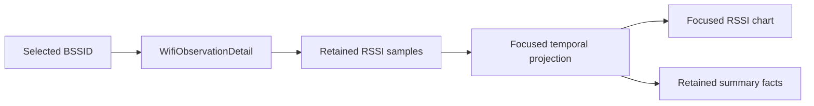

# Focused AP Temporal Detail

## Status

**Phase:** 2C.2  
**Scope:** selected-BSSID RSSI history detail  
**Identity:** exact BSSID inherited from Phase 2C.1  
**Persistence:** none  
**Recommendation/scoring:** none

## Purpose

Phase 2C.2 turns the Phase 2C.1 selected access point into a temporal inspection surface.

The selected access point already owns a bounded list of retained RSSI samples through `WifiObservationDetail`. This phase projects that exact-BSSID history into a compact, dedicated timeline and a small set of descriptive retained-history facts.

No new scan acquisition, persistence, RF inference, or scoring model is introduced.

## Data flow

## Focused temporal contract

The focused view uses only `detail.retainedSignalSamples`, which are already keyed to the exact selected BSSID by the Phase 2C.1 resolver.

The projection provides:

- chronological RSSI points;
- a display limit of the newest 60 retained samples;
- an adaptive focused RSSI viewport rounded outward to 10 dB grid lines;
- a minimum focused RSSI span of 20 dB so nearly-flat histories remain readable;
- retained sample count;
- latest retained RSSI;
- strongest retained RSSI;
- weakest retained RSSI;
- retained RSSI range.

The summary describes the bounded in-memory history only. It is not a lifetime access-point statistic.

## UI behavior

When a selectable BSSID is selected in **Nearby networks**, its existing Phase 2C.1 detail card now adds:

- **Focused RSSI history**;
- a single-series temporal chart for that BSSID;
- latest / strongest / weakest retained RSSI;
- retained RSSI range.

The global **Signal history** chart remains unchanged and continues to follow the selected spectrum band plus All / Strongest 5 / Weakest 5 scope.

The focused chart does not inherit those global filters because its scope is the exact selected BSSID.

Its vertical scale is also intentionally independent from the global multi-BSSID chart. The global chart keeps a common comparison scale, while the focused chart adapts to the retained RSSI range for the selected BSSID so strong signals above -30 dBm are not visually clamped.

### Sticky focused session

Physical-device validation showed that a selected BSSID may be transiently absent from an Android scan. Phase 2C.2 therefore upgrades selection from a one-snapshot expansion to a sticky in-memory focused session.

If the selected BSSID is missed by a later scan, Yeyecatl keeps the detail panel open using the last known normalized observation and retained temporal history. The panel is explicitly marked **Not seen in latest scan** and current RSSI wording changes to **Last observed RSSI**. When the BSSID reappears, live/current detail resumes automatically.

Nearby-network filters and sorting also do not clear the focused session. If the selected row is hidden by the current query, the focused detail remains available separately below the list.

The focused session ends only when the user clears it, selects another BSSID, or the in-memory application/session state is reset.

## Truthfulness constraints

Phase 2C.2 deliberately avoids claims that the current in-memory model cannot support:

- no lifetime first-seen / last-seen timestamps;
- no persistence across app restarts;
- no distance estimation;
- no signal-quality score;
- no stability score;
- no trend prediction;
- no recommendation.

The wording **retained** remains important because Phase 2A history is bounded and older samples may have been evicted.

## Tests

Unit tests define:

- chronological projection;
- newest-point display limiting;
- retained latest / strongest / weakest / range semantics;
- empty-history behavior;
- invalid display-limit rejection.

Compose instrumentation extends the Phase 2C.1 selection flow to verify:

- focused temporal summary labels and values;
- focused chart visibility for the selected exact BSSID;
- selection clearing still removes the detail surface.

## Phase 2C.2 device acceptance

On the Galaxy J8:

1. start dynamic scan and allow multiple fresh samples to accumulate;
2. select one BSSID in **Nearby networks**;
3. confirm that the focused RSSI line evolves only for that selected BSSID;
4. confirm latest / strongest / weakest / range values are consistent with the visible retained history;
5. select another BSSID and confirm the focused timeline switches identity;
6. clear selection and confirm the focused detail disappears.

Phase 2C.2 is complete after physical-device evidence demonstrates the exact-BSSID focused temporal view under real scan cadence.
