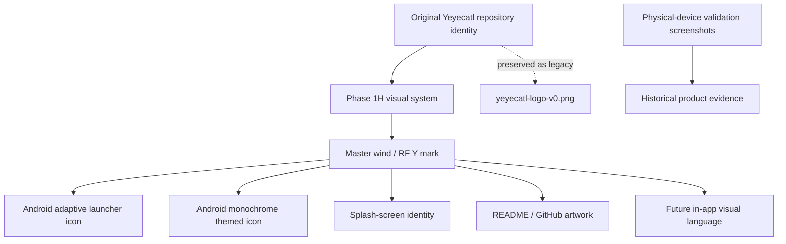

# Yeyecatl — Phase 1H Visual Identity

**Project:** Yeyecatl  
**Phase:** 1H — Visual Identity and Android Branding  
**Status:** Design package prepared; implementation in the Android resources is the next step.  
**Date:** 2026-10-02

---

## 1. Objective

Phase 1H gives Yeyecatl a coherent visual identity across the Android launcher, splash experience, GitHub/README presentation, documentation, and later in-app surfaces.

The goal is not simply to replace the default Android icon. The goal is to establish a reusable identity system that visually communicates:

- **wind / moving air** — the conceptual origin of the Yeyecatl name;
- **radio-frequency observation** — the invisible medium the application measures;
- **field mobility** — Yeyecatl as the Android/mobile observer;
- **2.4 GHz, 5 GHz, and 6 GHz** — the three Wi-Fi bands represented by the product;
- **technical measurement** rather than a generic consumer Wi-Fi utility.

The identity should remain recognizable at launcher-icon scale and should also expand naturally into documentation artwork, splash visuals, screenshots, and future application surfaces.

---

## 2. Relationship with the existing Yeyecatl imagery

Yeyecatl already has a project identity in the repository. The current README uses:

```text
docs/assets/yeyecatl-logo.png
```

Phase 1H should **evolve this identity rather than erase it**.

The recommended treatment is:

1. Preserve the current logo as the **original / v0 identity artifact**.
2. Review it alongside the new Phase 1H direction when integrating the assets in the repository.
3. Move the historical image to a clearly marked legacy location if the canonical logo is replaced.
4. Use the new Phase 1H mark as the production identity shared by Android and repository documentation.

Recommended legacy path:

```text
docs/assets/branding/legacy/yeyecatl-logo-v0.png
```

The existing physical-device screenshots under the validation documentation should also remain untouched. They are evidence of Yeyecatl's first working RF pipeline, not branding assets:

```text
docs/validation/v0/
├── yeyecatl-v0-01.jpg
└── yeyecatl-v0-02.jpg
```

This gives the project two complementary visual histories:

```text
project identity               product evidence
      │                              │
      ▼                              ▼
logo / icon / splash        physical-device screenshots
      │                              │
      ▼                              ▼
Phase 1H visual system      Phase 1G/v0 validation history
```

The new branding should therefore **coexist with the project's visual archaeology**, not overwrite it.

---

## 3. Core visual concept

The central symbol is an abstract **wind + RF-spectrum mark**.

It uses flowing strokes that converge into a subtle **Y**:

```text
       wind / moving air
              │
       ╭──────┴──────╮
       │      │      │
     2.4     5 GHz   6 GHz
       │      │      │
       ╰──────┬──────╯
              │
         subtle "Y"
              │
           YEYECATL
```

The symbol is deliberately **not** the conventional Wi-Fi fan icon. That would make Yeyecatl visually indistinguishable from common Wi-Fi scanner, router, and hotspot applications.

The mark also avoids invented pseudo-historical or generic "Aztec-style" ornament. The cultural connection stays in the project's name and wind concept, while the graphic system remains contemporary, technical, and original.

### Visual character

The intended personality is:

- technical;
- atmospheric;
- precise;
- dark and restrained;
- slightly mysterious;
- modern rather than retro;
- professional enough for a measurement/analyzer tool.

---

## 4. Visual language

### Primary palette

The generated identity establishes the following practical palette direction:

| Role | Approximate color | Purpose |
|---|---:|---|
| Obsidian | `#040B12` | Main dark background |
| Deep graphite-blue | `#07161F` | Secondary background / surfaces |
| Spectrum deep cyan | `#094762` | Low-intensity RF accents |
| Spectrum blue | `#0592BE` | Secondary signal accent |
| Luminous cyan | `#1BD8E5` | Primary identity highlight |
| Ice white | `#D8E6EB` | Wordmark / high-contrast text |
| Warm amber | restrained accent | Optional 6 GHz / contrast accent |

The palette is intentionally dominated by dark graphite, teal, cyan, and blue. Amber should remain a minor signal/spectrum accent rather than becoming a second primary brand color.

### Geometry

The mark should remain:

- symmetrical or near-symmetrical;
- readable as a flowing Y;
- free of small internal details that disappear at launcher scale;
- visually balanced inside Android's adaptive-icon safe zone;
- recognizable in both color and a single flat monochrome tone.

---

## 5. Assets generated for Phase 1H

### 5.1 Brand board / repository hero

**File:** `yeyecatl-brand-board.png`

Purpose:

- establishes the full visual direction;
- combines symbol, wordmark, spectrum language, and the 2.4/5/6 GHz concept;
- suitable as a README hero/reference image;
- useful as the canonical visual reference when implementing the Android resources.

This asset should be treated as a **brand presentation image**, not as the launcher icon itself.

---

### 5.2 Launcher icon concept

**File:** `yeyecatl-launcher-icon-concept.png`

Purpose:

- demonstrates the Yeyecatl mark at app-icon scale;
- verifies that the mark remains recognizable without the wordmark;
- establishes the preferred dark-background + cyan/teal treatment.

Important implementation note: the rendered rounded square and glow are **conceptual presentation**, not the final Android resource structure. Android should receive independent adaptive-icon foreground/background resources and apply the system mask itself.

---

### 5.3 Monochrome / themed-icon concept

**File:** `yeyecatl-themed-icon-monochrome-concept.png`

Purpose:

- validates that the symbol works without gradients;
- provides the basis for Android themed icons;
- demonstrates that the identity does not depend on glow or color.

This is especially important because a strong app symbol should remain recognizable even after Android recolors it according to the user's wallpaper/theme.

---

### 5.4 Splash-screen concept

**File:** `yeyecatl-splash-screen-concept.png`

Purpose:

- establishes the desired startup mood;
- connects the launcher identity with the RF-spectrum visual language;
- provides a presentation/reference asset for the visual system.

For the production Android splash screen, the implementation should remain simpler than the concept artwork. Android's splash-screen API should show the core Yeyecatl mark and appropriate background without creating an unnecessarily long branded intro.

---

## 6. Recommended repository layout

```text
docs/
├── assets/
│   ├── yeyecatl-logo.png                 # canonical README/project logo
│   └── branding/
│       ├── yeyecatl-brand-board.png
│       ├── yeyecatl-mark-color.png
│       ├── yeyecatl-mark-monochrome.png
│       ├── yeyecatl-launcher-icon-concept.png
│       ├── yeyecatl-splash-screen-concept.png
│       └── legacy/
│           └── yeyecatl-logo-v0.png
│
└── design/
    └── visual-identity.md

app/src/main/res/
├── drawable/
│   ├── ic_launcher_foreground.xml
│   └── ic_launcher_monochrome.xml
│
├── mipmap-anydpi-v26/
│   ├── ic_launcher.xml
│   └── ic_launcher_round.xml
│
├── mipmap-*/
│   └── fallback launcher resources
│
└── values/
    ├── colors.xml
    └── themes.xml
```

The documentation images and Android resources should share the **same symbol geometry**, even when their rendering differs.

---

## 7. Identity lineage



This separates **identity evolution** from **product-history preservation**.

---

## 8. Android implementation rules

The Phase 1H artwork should not simply be copied into `mipmap` as one flattened square PNG.

The launcher should use Android's adaptive-icon model:

```text
adaptive icon
├── background
│   └── dark obsidian / graphite field
│
├── foreground
│   └── Yeyecatl wind/RF mark
│
└── monochrome
    └── single-color form of the same mark
```

This provides:

- correct system masks;
- circle, squircle, rounded-square, and OEM launcher compatibility;
- Android themed-icon support;
- better scaling across densities;
- a cleaner path for future visual changes.

The master symbol should eventually be represented as vector geometry (SVG for documentation/design and/or Android VectorDrawable XML where practical), rather than depending only on generated raster artwork.

---

## 9. What Phase 1H should modify

When implementation begins, the expected code/repository work is:

1. Preserve the current `docs/assets/yeyecatl-logo.png` as a historical artifact before replacing the canonical visual if needed.
2. Add the new branding directory and design documentation.
3. Rebuild the launcher mark as Android adaptive-icon resources.
4. Add the monochrome themed-icon resource.
5. Replace the default Android launcher identity.
6. Configure the splash-screen theme around the Yeyecatl mark.
7. Update the README to use the canonical Phase 1H identity.
8. Update `PROJECT.md` with Phase 1H completion/status.
9. Validate the icon on at least one physical Android device.
10. Run the existing build/lint/check pipeline after resource changes.

---

## 10. Acceptance criteria

Phase 1H is complete when:

- [ ] The default Android launcher icon is gone.
- [ ] Yeyecatl has a dedicated adaptive launcher icon.
- [ ] The icon remains readable under multiple Android launcher masks.
- [ ] A monochrome themed-icon resource exists.
- [ ] The application startup uses the Yeyecatl visual identity.
- [ ] The README/GitHub identity and Android identity use the same core mark.
- [ ] The original repository logo is preserved as historical/legacy material if replaced.
- [ ] Validation screenshots remain untouched as product evidence.
- [ ] Build, lint, and checks pass after the resource changes.
- [ ] The result has been visually checked on a physical device.

---

## 11. Deliverables in this package

```text
yeyecatl-phase-1h-visual-identity/
├── phase-1h-visual-identity-report.md
├── yeyecatl-brand-board.png
├── yeyecatl-launcher-icon-concept.png
├── yeyecatl-themed-icon-monochrome-concept.png
└── yeyecatl-splash-screen-concept.png
```

These assets establish the approved **design direction**. The next engineering step is to translate the master mark into production Android adaptive-icon/vector resources and wire them into the application theme and launcher configuration.

---

## 12. Final direction

Phase 1H should preserve the continuity of the existing Yeyecatl identity while making it mature enough to function as a real Android product identity.

The new mark gives the project a visual shorthand with multiple meanings:

```text
wind
  +
radio spectrum
  +
2.4 / 5 / 6 GHz
  +
subtle Y
  =
YEYECATL
```

That combination is more specific to the project than a generic Wi-Fi glyph and creates a visual system that can grow with the application instead of being replaced again after the first release.
