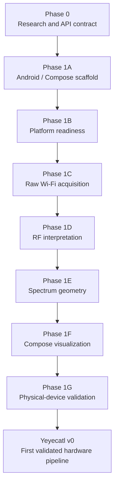
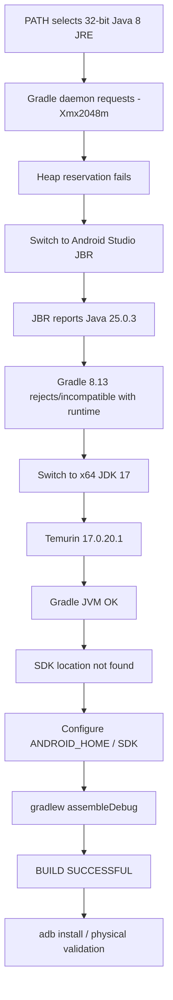

# Yeyecatl — Phase Prompts and Android Build Troubleshooting Report

**Project:** Yeyecatl  
**Repository:** `M:\ATOL\GitProjects\yeyecatl`  
**Report date:** 2026-10-02  
**Suggested repository location:** `docs/development/phase-prompts-and-build-troubleshooting.md`

---

## 1. Purpose

This report consolidates the development prompts used to drive the first Yeyecatl implementation cycle and records the final troubleshooting sequence used to make the Android/Gradle/Java toolchain reproducible.

The phase prompts below are **normalized reconstructions** of the instructions used during the project. They preserve the scope, exclusions, validation gates, architecture decisions, and stop conditions from the original phase work. Where the exact original prose was not retained verbatim, the prompt is reconstructed from the phase instructions and completion reports rather than presented as a literal transcript.

The report covers:

- Phase 0 — research and design
- Phase 1A — Android project scaffold
- Phase 1B — platform readiness and permissions
- Phase 1C — raw Wi-Fi acquisition
- Phase 1D — RF interpretation
- Phase 1E — spectrum geometry and overlap
- Phase 1F — spectrum visualization
- Phase 1G — physical-device validation
- Gradle / Java / Android SDK troubleshooting
- The reusable prompting pattern that emerged across the phases

---

## 2. Development Model

Yeyecatl was intentionally developed as a sequence of bounded phases. Each prompt had four important properties:

1. implement only the current architectural layer;
2. explicitly state what was **out of scope**;
3. require tests and documentation with the implementation;
4. stop before beginning the next phase.

### ASCII overview

```text
Phase 0
Research / API contract
        |
        v
Phase 1A
Android / Compose scaffold
        |
        v
Phase 1B
Platform readiness
permissions + capability state
        |
        v
Phase 1C
Raw Wi-Fi acquisition
        |
        v
Phase 1D
RF interpretation
band / channel / width / standard
        |
        v
Phase 1E
Spectrum geometry
occupied spans + overlap math
        |
        v
Phase 1F
Compose visualization
        |
        v
Phase 1G
Physical-device validation
        |
        v
      Yeyecatl v0
```

### Mermaid overview



---

# 3. Phase Prompts

## 3.1 Phase 0 — Android Wi-Fi Research and Design

### Objective

Establish the Android platform contract before creating the production scanner.

### Prompt

```text
Work on Phase 0 only.

This phase is research and design. Do not modify project files.

Research the Android Wi-Fi scanning APIs and verify important platform
behavior against official Android documentation.

Define the platform contract that Yeyecatl Phase 1 will use.

Cover at least:

- WifiManager.startScan()
- WifiManager.getScanResults()
- SCAN_RESULTS_AVAILABLE_ACTION
- EXTRA_RESULTS_UPDATED
- permissions and API-level differences
- Location Services requirements
- scan throttling
- stale/cached scan results
- Wi-Fi disabled state
- devices without Wi-Fi capability
- foreground versus background behavior
- relevant ScanResult metadata
- Android limitations for 2.4, 5 and 6 GHz observation

Separate clearly:

1. behavior documented by Android;
2. behavior inferred from device/runtime conditions;
3. Yeyecatl design decisions.

Define the architecture boundary so Android-specific APIs do not leak
directly into the domain or UI layers.

Define Phase 1 acceptance criteria and the states that the application
must represent.

Do not implement the scanner yet.

Stop after the Phase 0 research/design result.
```

### Key decisions established

- Scanning would be foreground and user-triggered.
- Yeyecatl would not promise real-time Wi-Fi scanning.
- Freshness/status would be modeled separately from the data itself.
- Cached/stale results would remain valid observations but would be identified as such.
- Direct `WifiManager` access would remain behind the platform/repository boundary.
- Device capabilities and Android-version differences would be treated as part of the observation context.
- Yeyecatl would remain a Wi-Fi analyzer, not an SDR or laboratory RF spectrum analyzer.

---

## 3.2 Phase 1A — Android Project Scaffold

### Objective

Create a buildable Android/Compose project with the intended architectural boundaries but no Wi-Fi functionality yet.

### Important prerequisite

The first attempt correctly stopped because the Android package identity had not yet been decided.

The identity was then frozen as:

```text
namespace     = io.github.dante_souza.yeyecatl
applicationId = io.github.dante_souza.yeyecatl
```

### Prompt

```text
Implement Phase 1A only.

Preserve the project identity:

namespace     = io.github.dante_souza.yeyecatl
applicationId = io.github.dante_souza.yeyecatl

Create the Android/Gradle/Jetpack Compose scaffold for Yeyecatl.

Establish package and architecture boundaries for at least:

- domain
- data
- platform
- platform/wifi
- ui

Create the minimal application and Compose entry point needed to prove
that the project builds.

Add:

- Gradle wrapper and Android build configuration
- Compose application shell
- package placeholders/boundaries
- JVM smoke tests
- instrumentation/UI smoke test skeleton where appropriate
- architecture documentation
- ADR for the initial Android baseline
- Makefile targets for routine development

Required Makefile entry points should include the equivalent of:

- setup
- build
- assemble-debug
- test
- unit-test
- lint
- check
- clean
- install-debug
- adb-devices

Do not implement:

- Wi-Fi scan permissions
- WifiManager scanning
- RF interpretation
- channel mapping
- persistence
- export
- CI/CD

Validate through the Makefile.

At minimum run:

make setup
make build
make unit-test
make check

Do not begin Phase 1B.
```

### Result

Phase 1A established the reproducible Android/Compose project and the architecture in which later platform work could be added without coupling the UI directly to Android Wi-Fi APIs.

---

## 3.3 Phase 1B — Android Platform Readiness

### Objective

Represent whether the Android device is capable and ready to perform a Wi-Fi scan, without actually performing one.

### Prompt

```text
Implement Phase 1B only.

Build on the Phase 1A architecture and preserve the existing namespace,
applicationId, package boundaries and Makefile-first workflow.

Implement Android Wi-Fi readiness only.

Add the required manifest declarations and model the API-level permission
requirements needed for Wi-Fi observation.

Create an abstraction for platform readiness/capability that can represent
conditions such as:

- device has no Wi-Fi feature
- Wi-Fi is disabled
- required permission is missing
- permission request is accepted
- permission request is rejected
- Location Services are disabled where relevant
- platform is ready for scanning

Keep the readiness model Android-independent outside the platform layer.

Implement a minimal Compose readiness UI.

Permission requests must be explicit and user-triggered using the Android
Activity Result permission flow.

Add JVM tests for deterministic readiness/permission logic.

Improve Makefile diagnostics so setup/doctor information includes useful
Android development environment information such as:

- JAVA_HOME
- Java runtime
- Android SDK environment
- adb availability/version
- Gradle runtime
- Android Gradle Plugin version

Document the permission/API matrix and architecture decision.

Do not implement:

- actual Wi-Fi scanning
- scan-result collection
- RF interpretation
- spectrum geometry
- persistence
- export
- CI/CD

Validate with:

make setup
make build
make unit-test
make lint
make check

Stop before Phase 1C.
```

### Result

The application could now explain *why* scanning was or was not possible before attempting acquisition.

---

## 3.4 Phase 1C — Raw Wi-Fi Acquisition

### Objective

Implement the first real Android Wi-Fi acquisition pipeline while keeping scan results platform-neutral above the adapter layer.

### Prompt

```text
Implement Phase 1C only.

Implement real Wi-Fi acquisition using Android WifiManager.

Use the platform contract established during Phase 0:

- WifiManager.startScan()
- WifiManager.getScanResults()
- SCAN_RESULTS_AVAILABLE_ACTION
- EXTRA_RESULTS_UPDATED

Create Android-independent raw Wi-Fi observation models.

The platform adapter/repository must map Android ScanResult objects into
those models before the information reaches the rest of the application.

Represent scan lifecycle/state explicitly.

Distinguish fresh scan results from cached/stale results.

Handle:

- startScan() accepted/rejected
- scan throttling
- EXTRA_RESULTS_UPDATED
- cached results
- empty result sets
- SecurityException
- Wi-Fi unavailable/disabled
- lifecycle-safe receiver registration
- platform/API differences

Do not implement automatic retries that fight Android scan throttling.

Scanning must remain explicit and user-triggered.

Add a Scan action and enough diagnostic UI to observe scan state and raw
network observations.

Preserve duplicate SSIDs when BSSIDs differ.

Handle hidden/blank SSIDs safely.

Add JVM tests for platform-independent mapping/state behavior.

Add/update architecture documentation and ADRs.

Do not implement:

- RF channel interpretation
- interference analysis
- spectrum overlap
- persistence
- export
- periodic/background scanning
- CI/CD

Validate using the Makefile and stop before Phase 1D.
```

### Result

Yeyecatl gained its first real acquisition boundary:

```text
Android WifiManager
        |
        v
Android adapter
        |
        v
Raw observation model
        |
        v
Application/UI
```

---

## 3.5 Phase 1D — RF Interpretation

### Objective

Convert raw frequency/channel metadata into deterministic RF information without mixing interpretation with Android collection code.

### Prompt

```text
Implement Phase 1D only.

Create a pure Kotlin, Android-independent RF interpretation layer.

Input must be the raw observation metadata produced by Phase 1C.

Preserve the original/raw metadata even when interpretation is possible.

Implement deterministic interpretation for:

- 2.4 GHz
- 5 GHz
- 6 GHz

Recognize 60 GHz observations where Android exposes them, even if the
initial UI does not fully visualize that band.

Interpret where possible:

- Wi-Fi band
- primary channel
- channel width
- center frequency / center channel information
- Wi-Fi standard / generation metadata

Handle API-level differences safely.

Do not fabricate information when Android does not expose enough metadata.

Represent unknown, unsupported or incomplete metadata explicitly.

Keep all deterministic mapping logic pure and JVM-testable.

Add comprehensive JVM tests for:

- known frequencies
- edge frequencies
- valid channels
- invalid/unknown frequencies
- 2.4/5/6 GHz classification
- widths
- center-channel metadata
- standard mapping
- incomplete observations

Document the RF interpretation boundary and assumptions.

Do not implement:

- spectrum overlap
- interference scoring
- channel recommendations
- visualization
- persistence
- export
- CI/CD

Validate through the Makefile.

Stop before Phase 1E.
```

---

## 3.6 Phase 1E — Spectrum Geometry and Mathematical Overlap

### Objective

Turn interpreted RF observations into nominal occupied-frequency geometry suitable for later visualization.

### Prompt

```text
Implement Phase 1E only.

Create an Android-independent spectrum geometry layer.

Consume the interpreted RF data produced by Phase 1D.

Represent the nominal occupied frequency span of Wi-Fi observations.

Support the channel-width forms exposed by the platform, including:

- 20 MHz
- 40 MHz
- 80 MHz
- 160 MHz
- 320 MHz
- segmented 80+80 MHz

Model geometry validity explicitly, including cases equivalent to:

- complete
- partial
- unavailable

Do not invent missing center-frequency metadata.

Implement mathematical interval overlap using frequency-domain geometry.

The overlap model is geometric only.

It must not claim that geometric overlap is equivalent to measured
interference or actual airtime contention.

Handle observations with partial metadata safely.

Add pure JVM tests for:

- occupied spans
- center/width combinations
- 80+80 segments
- 320 MHz channels
- partial geometry
- unavailable geometry
- overlap and non-overlap
- edge-touching interval behavior

Add/update architecture documentation and ADRs.

Do not implement:

- interference analysis
- channel scoring
- channel recommendations
- RF quality ratings
- spectrum visualization
- persistence
- export
- CI/CD

Validate through the Makefile.

Record the status of physical-device validation, but do not expand this
phase into Phase 1G.

Stop before Phase 1F.
```

---

## 3.7 Phase 1F — Spectrum Visualization

### Objective

Render the domain geometry produced by Phase 1E without reimplementing RF calculations in the UI.

### Prompt

```text
Implement Phase 1F only.

Create the Wi-Fi spectrum visualization in Jetpack Compose.

The visualization must consume the domain geometry generated by Phase 1E.

Do not recalculate RF channel geometry in the UI layer.

Provide separate spectrum views for:

- 2.4 GHz
- 5 GHz
- 6 GHz

Use frequency in MHz as the horizontal coordinate system.

Represent RSSI in dBm on the vertical dimension where applicable.

Render channel/occupied-spectrum geometry deterministically.

Support visualization of:

- standard contiguous channel widths
- 80+80 MHz segmented geometry
- 320 MHz geometry
- partial geometry
- unavailable geometry

Keep ordering and label behavior deterministic.

Provide readable text/accessibility fallback so the information is not
available only as Canvas graphics.

Add Compose previews where useful.

Keep projection/math that can be tested outside Android in pure Kotlin and
cover it with JVM tests.

Document the visualization architecture and the UI/domain boundary.

Do not implement:

- RF recalculation in Compose
- interference scoring
- channel recommendations
- persistence
- export
- CI/CD

Validate through the Makefile.

Physical-device visualization validation may remain pending until Phase 1G.

Stop before Phase 1G.
```

### Result

The principal visualization boundary became:

```text
Raw ScanResult
     |
     v
Raw observation
     |
     v
RF interpretation
     |
     v
Spectrum geometry
     |
     v
UI projection
     |
     v
Compose Canvas
```

---

## 3.8 Phase 1G — Physical-Device Validation

### Objective

Validate the entire Yeyecatl v0 pipeline on actual Android hardware and create reproducible runtime diagnostics.

### Prompt

```text
Implement Phase 1G only.

The goal of this phase is physical-device validation and runtime
diagnostics.

Do not add new RF-analysis features.

Validate the complete existing pipeline:

permission/readiness
    ->
Android scan request/result
    ->
raw observation
    ->
RF interpretation
    ->
spectrum geometry
    ->
Compose spectrum visualization

Add Makefile-driven device diagnostics and validation helpers.

Provide commands/targets for operations such as:

- adb device discovery
- device information
- APK installation
- application launch/smoke validation
- application logcat
- instrumentation tests where possible

Add debug-only structured logging for the scan lifecycle where useful.

Create a reusable physical-device validation checklist/document.

Verify on real hardware:

- application builds
- APK installs
- application launches
- permissions can be granted
- Wi-Fi observations are acquired
- SSID/BSSID mapping works
- RSSI is populated
- frequency is populated
- channel interpretation works
- width metadata is handled
- spectrum geometry is produced
- band selector/UI works
- spectrum chart renders real observations

Record any hardware or Android limitations rather than hiding them.

Preserve the current non-goals:

- no interference analysis
- no channel scoring
- no channel recommendations
- no persistence
- no export
- no CI/CD

Run the normal software validation plus device diagnostics.

Do not start the next development phase.
```

### Initial physical validation status

The first physical-device attempt used a Xiaomi `220233L2G` / Redmi 10A running Android 11 / API 30.

ADB/device diagnostics worked, but APK installation was blocked by the device policy:

```text
INSTALL_FAILED_USER_RESTRICTED: Install canceled by user
```

Therefore Phase 1G implementation checks passed, but the real pipeline could not yet be declared validated.

### Final physical validation

Validation was later completed successfully on:

```text
Device: Samsung Galaxy J8
Model: SM-J810M
Android: 10
API: 29
```

The final hardware run confirmed:

- APK build
- APK installation
- application launch
- real Wi-Fi scan acquisition
- SSID/BSSID observations
- RSSI
- frequency
- channel
- channel-width handling
- 2.4 GHz spectrum geometry
- band UI
- Compose visualization

Approximately **65 networks** were observed during the validation run.

Evidence was placed under:

```text
docs/validation/v0/
```

This completed the first Yeyecatl v0 hardware-validation milestone.

---

# 4. Prompting Pattern Used Across the Project

The successful phase prompts converged on a repeatable structure.

## Reusable phase template

```text
Implement Phase <PHASE> only.

Goal:
<one bounded architectural objective>

Preserve:
- existing package/application identity
- architecture boundaries
- Makefile-first workflow
- previous phase behavior

Implement:
- <feature 1>
- <feature 2>
- <feature 3>

Architecture constraints:
- keep Android-specific behavior behind platform adapters
- keep deterministic logic pure/JVM-testable where possible
- do not duplicate calculations across layers
- represent unavailable/unknown data explicitly

Tests:
- <deterministic cases>
- <edge cases>
- <failure cases>

Documentation:
- update architecture documentation
- add/update ADR where the design decision is important

Out of scope:
- <next-phase feature>
- <other intentionally excluded work>

Validation:
make setup
make build
make unit-test
make lint
make check

Stop before Phase <NEXT>.
```

The explicit **“stop before the next phase”** instruction was particularly useful. It prevented an implementation agent from silently expanding scope and made review boundaries much clearer.

---

# 5. Gradle / Java / Android SDK Troubleshooting

## 5.1 Failure Chain

The Android build problems were not caused by Yeyecatl application code. They came from the local Java/toolchain selection.

The sequence was:

```text
System PATH
   |
   v
32-bit Java 8 JRE
C:\Program Files (x86)\Java\jre1.8.0_503
   |
   v
Gradle daemon requests -Xmx2048m
   |
   v
FAIL
Could not reserve enough space for 2097152KB object heap
   |
   v
Try Android Studio JBR
   |
   v
Java 25.0.3
   |
   v
Gradle 8.13 incompatibility
"What went wrong: 25.0.3"
   |
   v
Switch Gradle to x64 JDK 17
   |
   v
Temurin 17.0.20.1
   |
   v
Java/Gradle compatible
   |
   v
SDK location not found
   |
   v
Configure Android SDK
   |
   v
assembleDebug
   |
   v
BUILD SUCCESSFUL
```

### Mermaid version



---

## 5.2 Problem 1 — 32-bit Java 8 JRE

The first failing Java executable was:

```text
C:\Program Files (x86)\Java\jre1.8.0_503\bin\java.exe
```

Gradle attempted to start with a heap setting equivalent to:

```text
-Xmx2048m
```

The 32-bit runtime could not reserve the requested heap and failed with:

```text
Could not reserve enough space for 2097152KB object heap
```

### Diagnostic commands

From the repository root:

```powershell
java -version
where.exe java
$env:JAVA_HOME
.\gradlew.bat -version
```

These commands answer four different questions:

| Command | Purpose |
|---|---|
| `java -version` | Shows the Java runtime selected by the current shell |
| `where.exe java` | Shows every `java.exe` visible through `PATH` |
| `$env:JAVA_HOME` | Shows the Java home explicitly configured for tools |
| `.\gradlew.bat -version` | Shows the JVM Gradle is actually using |

The important rule is:

> Do not assume the JVM reported by `java -version` is automatically the same JVM being used by Gradle.

---

## 5.3 Problem 2 — Android Studio JBR Was Too New

Android Studio's bundled runtime was then tested as an alternative.

It reported:

```text
Java 25.0.3
```

With the Yeyecatl Gradle wrapper:

```text
Gradle 8.13
```

this produced a Gradle failure associated with Java `25.0.3`.

The practical conclusion was that Android Studio itself could run on the newer JBR, while the Yeyecatl build should use a supported Gradle JVM.

---

## 5.4 Stable Resolution — JDK 17

The stable toolchain was:

```text
JDK: Temurin 17.0.20.1
Gradle: 8.13
AGP: 8.13.2
```

JDK 17 became the project build runtime.

### Temporary PowerShell setup

Use the installed JDK 17 directory as `JAVA_HOME`.

Example:

```powershell
$env:JAVA_HOME = "<PATH-TO-JDK-17>"
$env:Path = "$env:JAVA_HOME\bin;$env:Path"

java -version
where.exe java
.\gradlew.bat -version
```

Expected result:

```text
Java: 17.x, 64-bit
Gradle JVM: Java 17
```

During the initial project validation, a JDK 17 under the Gradle JDK area was also used successfully. The important requirement is not the storage location; it is that Gradle resolves to a **64-bit JDK 17**.

---

## 5.5 Stop Existing Gradle Daemons After Changing Java

Gradle daemons may remain alive using the previous JVM.

After changing Java, stop them:

```powershell
.\gradlew.bat --stop
```

Then verify again:

```powershell
.\gradlew.bat -version
```

Only continue when the output shows the intended JDK.

---

## 5.6 Android SDK Configuration

After Java was corrected, the next failure was:

```text
SDK location not found
```

The Android SDK used on this machine was:

```text
C:\Users\dante\AppData\Local\Android\Sdk
```

### PowerShell environment

```powershell
$env:ANDROID_HOME = "C:\Users\dante\AppData\Local\Android\Sdk"
```

For tools that use `ANDROID_SDK_ROOT`, it can also be aligned with the same SDK:

```powershell
$env:ANDROID_SDK_ROOT = $env:ANDROID_HOME
```

Useful verification:

```powershell
$env:ANDROID_HOME
$env:ANDROID_SDK_ROOT
Test-Path "$env:ANDROID_HOME\platform-tools\adb.exe"
```

Expected final command:

```powershell
.\gradlew.bat assembleDebug
```

Expected result:

```text
BUILD SUCCESSFUL
```

---

# 6. Final Reproducible Troubleshooting Sequence

This is the compact sequence to use when Gradle suddenly resolves the wrong Java runtime again.

Run from:

```text
M:\ATOL\GitProjects\yeyecatl
```

## Step 1 — inspect Java resolution

```powershell
java -version
where.exe java
$env:JAVA_HOME
```

Look specifically for:

- Java 8
- a path under `Program Files (x86)`
- unexpected Java 25+
- multiple Java installations competing in `PATH`

---

## Step 2 — select JDK 17

```powershell
$env:JAVA_HOME = "<PATH-TO-TEMURIN-JDK-17>"
$env:Path = "$env:JAVA_HOME\bin;$env:Path"
```

Verify:

```powershell
java -version
where.exe java
```

---

## Step 3 — kill old Gradle daemons

```powershell
.\gradlew.bat --stop
```

---

## Step 4 — verify the Gradle JVM

```powershell
.\gradlew.bat -version
```

The important line must show Java 17.

---

## Step 5 — configure Android SDK

```powershell
$env:ANDROID_HOME = "C:\Users\dante\AppData\Local\Android\Sdk"
$env:ANDROID_SDK_ROOT = $env:ANDROID_HOME
```

Verify:

```powershell
Test-Path "$env:ANDROID_HOME\platform-tools\adb.exe"
```

---

## Step 6 — run the project diagnostics

```powershell
make setup
```

The Yeyecatl diagnostics should expose at least:

- `JAVA_HOME`
- Java runtime
- Android SDK location
- `adb` version
- Gradle runtime
- AGP version

---

## Step 7 — build

```powershell
make build
```

or directly:

```powershell
.\gradlew.bat assembleDebug
```

Expected result:

```text
BUILD SUCCESSFUL
```

---

## Step 8 — run the software validation suite

```powershell
make unit-test
make lint
make check
```

---

## Step 9 — verify the connected Android device

```powershell
adb devices
```

or through the canonical project entry point:

```powershell
make adb-devices
```

Then:

```powershell
make device-info
```

---

## Step 10 — install the APK

Using the project target:

```powershell
make install-debug
```

or directly, when needed:

```powershell
adb install -r .\app\build\outputs\apk\debug\app-debug.apk
```

---

## Step 11 — runtime diagnostics

```powershell
make device-smoke
make app-logcat
```

Where supported:

```powershell
make android-test
```

---

# 7. Device-Policy Failure Seen During Validation

On the Xiaomi/Redmi validation attempt, ADB communication was working but installation failed with:

```text
INSTALL_FAILED_USER_RESTRICTED: Install canceled by user
```

This is materially different from a Gradle/build failure.

The diagnostic distinction is:

```text
Gradle build successful?
        |
       yes
        |
        v
ADB sees device?
        |
       yes
        |
        v
adb install fails with USER_RESTRICTED
        |
        v
Device / OEM install policy
not application compilation
```

On MIUI-class devices, the relevant developer settings can include:

- USB debugging
- Install via USB
- USB debugging / security-related installation authorization

The Phase 1G software result was therefore correctly recorded as:

```text
Implementation validation: PASS
Physical-device validation: BLOCKED
Reason: device install policy
```

rather than incorrectly treating it as an application failure.

---

# 8. Final Validated Toolchain State

The first fully validated Yeyecatl v0 pipeline used the following effective build/runtime combination:

| Component | Validated state |
|---|---|
| Project | Yeyecatl |
| Repository | `M:\ATOL\GitProjects\yeyecatl` |
| namespace | `io.github.dante_souza.yeyecatl` |
| applicationId | `io.github.dante_souza.yeyecatl` |
| Gradle | 8.13 |
| Android Gradle Plugin | 8.13.2 |
| Build JVM | Temurin JDK 17.0.20.1, x64 |
| Android SDK | `C:\Users\dante\AppData\Local\Android\Sdk` |
| Physical validation device | Samsung Galaxy J8 SM-J810M |
| Android version | Android 10 / API 29 |
| Physical validation | PASS |
| Validation evidence | `docs/validation/v0/` |

---

# 9. Lessons From the Toolchain Incident

## 9.1 Java selection must be observable

A working `java.exe` on `PATH` is not enough.

The project should expose:

```text
JAVA_HOME
java -version
where java
Gradle JVM
Android SDK
adb
AGP
```

through the normal `make setup` / diagnostic workflow.

---

## 9.2 Android Studio's Java and Gradle's Java are separate concerns

Android Studio can legitimately run on a newer JetBrains Runtime while a project uses another supported JDK for Gradle.

For Yeyecatl:

```text
Android Studio JBR 25
        !=
Gradle build JVM 17
```

This is not inherently a problem as long as the Gradle JVM is configured explicitly.

---

## 9.3 A JRE is not an adequate Android build baseline

The initial runtime was both:

- Java 8;
- 32-bit;
- a JRE rather than the intended development JDK.

The project now treats an x64 JDK 17 as part of the expected build environment.

---

## 9.4 Build failures and device-policy failures must remain separate

The Xiaomi installation failure demonstrated why the validation workflow should distinguish:

```text
compile/build
      |
      v
APK generation
      |
      v
ADB transport
      |
      v
device installation policy
      |
      v
runtime behavior
```

A failure at one stage should not be reported as a failure at another.

---

# 10. Recommended Repository Role of This Report

This document can act as the historical prompt/runbook for Yeyecatl v0.

A useful documentation layout is:

```text
docs/
├── adr/
├── architecture/
├── testing/
├── validation/
│   └── v0/
└── development/
    └── phase-prompts-and-build-troubleshooting.md
```

It complements the architecture and validation documents by recording not only **what Yeyecatl became**, but also the bounded instructions used to produce each implementation stage.

---

# 11. Summary

Yeyecatl's first implementation cycle followed a deliberately constrained progression:

```text
research
 -> scaffold
 -> readiness
 -> acquisition
 -> RF interpretation
 -> geometry
 -> visualization
 -> hardware validation
```

The prompt design prevented scope leakage by making every phase define both what to implement and what **not** to implement.

The same principle proved valuable during toolchain debugging: Java runtime selection, Gradle compatibility, Android SDK configuration, APK generation, ADB communication, device policy, and runtime behavior were treated as separate layers.

The final stable build baseline was:

```text
Temurin JDK 17.0.20.1 x64
        +
Gradle 8.13
        +
Android Gradle Plugin 8.13.2
        +
Android SDK
C:\Users\dante\AppData\Local\Android\Sdk
```

With that environment corrected, Yeyecatl successfully built and the complete v0 Wi-Fi observation-to-spectrum pipeline was validated on the Samsung Galaxy J8.
